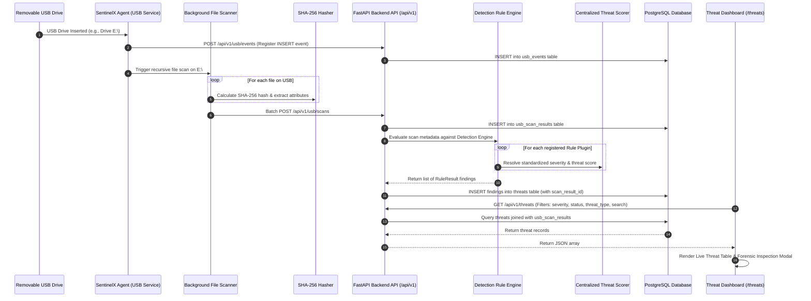

# SentinelX EDR — Phase 8 Complete Testing & Architecture Documentation

## 1. End-to-End USB & Threat Detection Flow

The complete automated threat detection lifecycle follows this pipeline:

```
Insert USB  ──>  Scan Files  ──>  Run Detection Rules  ──>  Create Threat Records  ──>  Display Threats
```

### Complete Sequence Diagram:


---

## 2. Detection Architecture

The **SentinelX EDR Detection Architecture** is modular, extensible, and completely decoupled from storage layers:

* **`BaseRule`** (`app.detection.rules.base`): Abstract base class defining the `evaluate()` contract for detection rule plugins.
* **`RuleResult`** (`app.detection.rules.base`): Standardized finding object containing `rule_name`, `threat_type`, `severity`, `description`, and `score`.
* **`DetectionEngine`** (`app.detection.engine`): Plugin registry maintaining an active list of rules. Aggregates findings when evaluating files.
* **`ThreatScorer`** (`app.detection.scoring`): Centralized scoring and severity engine. Standardizes severities (`LOW`, `MEDIUM`, `HIGH`, `CRITICAL`) and numeric risk scores (`25`, `50`, `75`, `100`), providing dynamic runtime customization.
* **`ThreatService`** (`app.services.threat_service`): Integrates DB persistence, duplicate detection prevention, status workflow updates, and statistics calculation.

---

## 3. Rule Descriptions

| Rule Class | Rule Name | Threat Type Enum | Standard Severity | Base Score | Trigger Condition |
|---|---|---|---|---|---|
| `KnownMalwareRule` | Known Malicious Signature Detected | `KNOWN_MALWARE` | `CRITICAL` | `100` | Matches SHA-256 cryptographic hash against threat intelligence database (e.g. EICAR strings). |
| `DoubleExtensionRule` | Double Extension Detection | `DOUBLE_EXTENSION` | `CRITICAL` | `100` | Deceptive dual extension spoofing (e.g. `invoice.pdf.exe`, `photo.jpg.vbs`). |
| `AutoRunRule` | Autorun Detection | `AUTORUN_SCRIPT` | `CRITICAL` | `100` | Detects `autorun.inf` and autorun configuration scripts on removable media. |
| `DangerousExtensionRule` | Dangerous Extension Detection | `SUSPICIOUS_EXTENSION` | `HIGH` | `75` | Dangerous executable or script format (`.exe`, `.dll`, `.bat`, `.ps1`, `.vbs`, `.js`, `.cmd`, `.sys`, `.scr`, etc.). |
| `HiddenExecutableRule` | Hidden Executable File on Removable Media | `HIDDEN_EXECUTABLE` | `HIGH` | `75` | Executable binary or script with hidden attribute (`is_hidden=True` or dotfile naming) on USB storage. |
| `AnomalousFileRule` | Anomalous System Process Masquerading | `ANOMALOUS_FILE` | `HIGH` | `75` | Matches critical OS binary names (`svchost.exe`, `lsass.exe`, `cmd.exe`) staged on removable media. |

---

## 4. API Endpoints Specification

### `GET /api/v1/threats`
* **Summary**: List threat records with multi-column filtering and pagination.
* **Query Parameters**:
  * `skip` (int, default `0`)
  * `limit` (int, default `100`)
  * `severity` (string: `CRITICAL`, `HIGH`, `MEDIUM`, `LOW`)
  * `status` (string: `NEW`, `ACKNOWLEDGED`, `RESOLVED`)
  * `threat_type` (string: `KNOWN_MALWARE`, `DOUBLE_EXTENSION`, etc.)
  * `search` (string: search in file name, rule name, or SHA-256 fingerprint)
* **Response**: List of `ThreatRecordOut` objects containing `id`, `file_name`, `full_path`, `sha256`, `threat_type`, `severity`, `rule_name`, `status`, `detected_at`.

### `GET /api/v1/threats/{id}`
* **Summary**: Retrieve single threat record detail.
* **Path Parameter**: `id` (UUID)
* **Response**: Single `ThreatRecordOut` object.

### `PATCH /api/v1/threats/{id}/status`
* **Summary**: Update incident status for a threat record.
* **Path Parameter**: `id` (UUID)
* **Body**: `{"status": "NEW" | "ACKNOWLEDGED" | "RESOLVED"}`
* **Response**: Updated `ThreatRecordOut` object.

### `GET /api/v1/threats/summary`
* **Summary**: Returns aggregate threat detection statistics, severity counts, and threat type counts.
* **Response**: `ThreatStatsOut` object.

### `POST /api/v1/threats/analyze/{usb_event_id}`
* **Summary**: On-demand re-analysis of all scan results for a given USB Event ID.

---

## 5. Test Scenarios & Verification Commands

### Automated Test Suites:
1. **End-to-End USB Threat Flow Test** ([test_e2e_phase8_complete_flow.py](file:///home/rebelshub/Desktop/sentinelx-edr/SentinelX-EDR/backend/tests/test_e2e_phase8_complete_flow.py)):
   * Verifies `Insert USB -> Scan Files -> Run Rules -> Create Threat Records -> Display Threats API`.
2. **Detection Engine Core Tests** ([test_detection_engine.py](file:///home/rebelshub/Desktop/sentinelx-edr/SentinelX-EDR/backend/tests/test_detection_engine.py)):
   * Evaluates individual rule plugins and custom rule registration.
3. **Centralized Scoring Tests** ([test_threat_scoring.py](file:///home/rebelshub/Desktop/sentinelx-edr/SentinelX-EDR/backend/tests/test_threat_scoring.py)):
   * Verifies standardized severity resolution, dynamic score adjustments, and composite score computation.
4. **Threat REST API & Database Tests** ([test_threat_detection.py](file:///home/rebelshub/Desktop/sentinelx-edr/SentinelX-EDR/backend/tests/test_threat_detection.py)):
   * Tests multi-parameter endpoint filtering, detail retrieval, and status updates.

### Executing Test Suite:
```bash
cd /home/rebelshub/Desktop/sentinelx-edr/SentinelX-EDR
PYTHONPATH=backend backend/venv/bin/pytest backend/tests
```
*(All 50 test cases pass cleanly)*
