```mermaid
sequenceDiagram
    autonumber
    participant USB as Removable USB Drive
    participant Detector as Agent USBDetectorService
    participant Worker as USBScanPipelineWorker
    participant Hasher as FileHasher (SHA-256)
    participant Client as APIClient
    participant Backend as FastAPI Backend API
    participant Engine as ThreatDetectionEngine
    participant DB as PostgreSQL Database
    participant UI as React Threat Dashboard

    USB->>Detector: USB Drive Inserted (e.g. E:)
    Detector->>Worker: Enqueue Scan Task (usb_event_id, drive_letter)
    
    rect rgb(20, 30, 50)
        Note over Worker,Engine: Background File Scanning & Threat Analysis
        Worker->>Worker: Enumerate files recursively
        loop For each file
            Worker->>Hasher: Calculate SHA-256 hash & extract metadata
            Worker->>Engine: Local Heuristic Analysis (AgentThreatEngine)
        end
        Worker->>Client: Upload Batch POST /api/v1/usb/scans
        Client->>Backend: POST /api/v1/usb/scans
        Backend->>DB: INSERT into usb_scan_results
        Backend->>Engine: Run Threat Detection Engine (threat_service)
        Engine->>DB: INSERT into threat_records table
    end

    UI->>Backend: GET /api/v1/threats (severity, status, search)
    Backend->>DB: Query indexed threat_records table
    DB-->>Backend: Return matching threat records & summary stats
    Backend-->>UI: Return JSON payload
    UI->>UI: Render Threat Dashboard & Forensic Modal
```

# SentinelX EDR — Day 6 Threat Detection Engine Architecture & Documentation

## 1. Executive Summary & Objective

Day 6 transforms raw USB file scan results into actionable, real-time security threat findings. When files on a removable USB drive are scanned and fingerprint hashes computed, the **Threat Detection Engine** analyzes each file against signature databases (known malware SHA-256 hashes), dual extension spoofing patterns, hidden executable attributes, USB AutoRun configurations, suspicious script extensions, and anomalous process name masquerading. Detected threats are stored in PostgreSQL (`threat_records`) and presented on an interactive **Threat Dashboard** with forensic inspection and remediation capabilities.

---

## 2. Updated End-to-End USB Forensic Pipeline

```
USB Inserted
      ↓
Scan Files
      ↓
Collect Metadata & SHA-256 Hash
      ↓
Analyze Every File (Threat Detection Engine)
      ↓
Detect Security Threats
      ↓
Store Threat Records (PostgreSQL threat_records)
      ↓
Show Live Threat Dashboard (React /threats Console)
```



---

## 3. Threat Detection Rules & Heuristics

| Threat Type | Code / Enum | Severity | Rule Description | Recommended Remediation |
|---|---|---|---|---|
| Known Malware | `KNOWN_MALWARE` | `CRITICAL` | SHA-256 matches threat intelligence signature database (e.g. EICAR test string, known payloads). | Isolate endpoint & immediately delete/quarantine payload. |
| Double Extension Spoofing | `DOUBLE_EXTENSION` | `CRITICAL` | File uses dual extension (e.g. `invoice.pdf.exe`, `photo.jpg.vbs`) to disguise binaries as documents. | Block execution and quarantine file. |
| Hidden Executable | `HIDDEN_EXECUTABLE` | `HIGH` | Executable binary/script with `is_hidden=True` or dotfile naming on removable media. | Disable hidden file execution and isolate file. |
| USB AutoRun Script | `AUTORUN_SCRIPT` | `HIGH` | Presence of `autorun.inf` or autorun payload scripts used for worm propagation. | Disable USB AutoRun via GPO and inspect referenced targets. |
| Suspicious Script | `SUSPICIOUS_EXTENSION` | `HIGH` | Script formats (`.vbs`, `.ps1`, `.bat`, `.cmd`, `.scr`, `.hta`) on removable drives. | Restrict script execution hosts from removable media. |
| Anomalous Process Name | `ANOMALOUS_FILE` | `HIGH` | File matches OS process name (e.g. `svchost.exe`, `lsass.exe`) on removable drive. | Verify digital signature and isolate endpoint if mismatched. |

---

## 4. Database Schema (`threat_records`)

| Field Name | Type | Description | Index |
|---|---|---|---|
| `id` | `UUID` | Primary Key (Default `uuid.uuid4`) | `True` |
| `usb_event_id` | `UUID` | Foreign Key → `usb_events.id` (`ON DELETE CASCADE`) | `True` |
| `scan_result_id` | `UUID` | Foreign Key → `usb_scan_results.id` (`ON DELETE SET NULL`) | `True` |
| `device_id` | `UUID` | Foreign Key → `devices.id` (`ON DELETE CASCADE`) | `True` |
| `file_name` | `String(255)` | File name | `False` |
| `full_path` | `Text` | Complete file path on USB drive | `False` |
| `sha256` | `String(64)` | SHA-256 cryptographic fingerprint | `True` |
| `threat_name` | `String(100)` | Descriptive threat title | `False` |
| `threat_type` | `String(50)` | Categorization (`KNOWN_MALWARE`, `DOUBLE_EXTENSION`, etc.) | `True` |
| `severity` | `String(20)` | Severity level (`CRITICAL`, `HIGH`, `MEDIUM`, `LOW`) | `True` |
| `description` | `Text` | Detailed technical reason for finding | `False` |
| `remediation` | `Text` | Guidance for incident responder | `False` |
| `status` | `String(30)` | Incident status (`OPEN`, `QUARANTINED`, `RESOLVED`, `FALSE_POSITIVE`) | `True` |
| `detected_at` | `DateTime(TZ)` | Detection timestamp (Default `NOW()`) | `True` |

---

## 5. REST API Specification

### `GET /api/v1/threats`
- **Description**: Retrieves threat records with multi-field filtering (`severity`, `threat_type`, `status`, `device_id`, `usb_event_id`, `search`) and pagination.

### `GET /api/v1/threats/summary`
- **Description**: Retrieves aggregate threat metrics, severity breakdown, and status counts.

### `GET /api/v1/threats/{id}`
- **Description**: Retrieves single threat record detail.

### `PATCH /api/v1/threats/{id}`
- **Description**: Updates threat incident status (`OPEN`, `QUARANTINED`, `RESOLVED`, `FALSE_POSITIVE`) and remediation analyst notes.

### `POST /api/v1/threats/analyze/{usb_event_id}`
- **Description**: Triggers on-demand Threat Engine re-analysis for all scan results of a given USB Event ID.

---

## 6. Test Suite & Verification Commands

### Run Backend Threat Engine Tests:
```bash
cd backend
source venv/bin/activate
PYTHONPATH=. pytest tests/test_threat_detection.py
```

### Run Agent Threat Engine Tests:
```bash
cd agent
PYTHONPATH=. ../backend/venv/bin/pytest tests/test_threat_engine.py
```

### Run Full End-to-End Day 6 Verification Script:
```bash
cd agent
PYTHONPATH=. ../backend/venv/bin/python verify_threat_engine.py --mock
```
