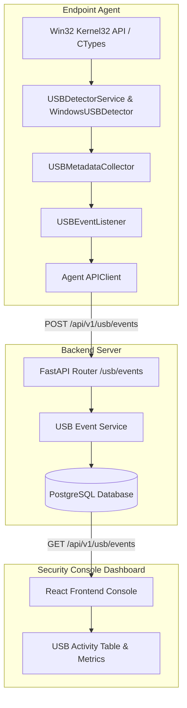

# SentinelX EDR — USB Event Pipeline & Architecture Documentation

## 1. System Architecture Diagram



---

## 2. USB Event Sequence Flow

```mermaid
sequenceDiagram
    autonumber
    participant HW as Physical USB Device
    participant Agent as Agent USB Detector
    participant Metadata as Metadata Collector
    participant Client as HTTP API Client
    participant Backend as FastAPI Backend API
    participant DB as PostgreSQL Database
    participant UI as React USB Activity Dashboard

    HW->>Agent: USB Drive Inserted (DRIVE_REMOVABLE E:)
    Agent->>Metadata: Extract volume_label, filesystem, capacity, free_space, serial_number
    Metadata-->>Agent: Return structured JSON payload
    Agent->>Agent: Filter duplicate events & generate USBEventData
    Agent->>Client: Emit event payload to APIClient
    
    rect rgb(20, 30, 50)
        Note over Client,Backend: Retrying HTTP Upload Pipeline
        Client->>Backend: POST /api/v1/usb/events (device_id, E:, INSERT, metadata)
        alt Temporary Network Failure
            Backend--xClient: Connection Timeout / HTTP 503
            Client->>Client: Exponential Backoff Wait (1s, 2s, 4s)
            Client->>Backend: POST /api/v1/usb/events (Retry Attempt)
        end
        Backend->>DB: INSERT into usb_events table
        DB-->>Backend: Persistent UUID record created
        Backend-->>Client: HTTP 201 CREATED (USBEventOut payload)
    end

    UI->>Backend: GET /api/v1/usb/events?skip=0&limit=10
    Backend->>DB: SELECT * FROM usb_events ORDER BY detected_at DESC
    DB-->>Backend: Return USB event rows
    Backend-->>UI: Return JSON Array
    UI->>UI: Update USB Activity Table & Insertion Metrics

    HW->>Agent: USB Drive Removed
    Agent->>Metadata: Capture removal snapshot
    Agent->>Client: POST /api/v1/usb/events (event_type: REMOVE)
    Client->>Backend: POST /api/v1/usb/events
    Backend->>DB: Store REMOVE event
    UI->>Backend: Refresh event stream & display REMOVED status badge
```



---

## 3. Backend REST API Documentation

### 1. `POST /api/v1/usb/events`
- **Description**: Transmits a newly detected USB insertion or removal event payload from an endpoint agent to the backend database.
- **Request Body Payload**:
```json
{
  "device_id": "3fa85f64-5717-4562-b3fc-2c963f66afa6",
  "event_type": "INSERT",
  "drive_letter": "E:",
  "volume_label": "KINGSTON",
  "filesystem": "FAT32",
  "total_size": 32017047552,
  "free_space": 15872184320,
  "serial_number": "KNG-USB-998877",
  "detected_at": "2026-07-25T22:30:00Z"
}
```
- **Responses**:
  - `201 Created`: Returns stored `USBEventOut` JSON object.
  - `404 Not Found`: Device UUID not registered.
  - `422 Unprocessable Entity`: Invalid event_type enum or malformed JSON.

---

### 2. `GET /api/v1/usb/events`
- **Description**: Retrieves a paginated list of USB events for audit analysis and dashboard rendering.
- **Query Parameters**:
  - `skip` (*int*, default: `0`): Pagination offset.
  - `limit` (*int*, default: `100`, max: `1000`): Maximum items per page.
  - `device_id` (*UUID*, optional): Filter by specific device ID.
  - `event_type` (*str*, optional): Filter by `INSERT` or `REMOVE`.
- **Response `200 OK`**:
```json
[
  {
    "id": "e84f74d0-5d66-4197-8c3b-28f8045952d7",
    "device_id": "3fa85f64-5717-4562-b3fc-2c963f66afa6",
    "event_type": "INSERT",
    "drive_letter": "E:",
    "volume_label": "KINGSTON",
    "filesystem": "FAT32",
    "total_size": 32017047552,
    "free_space": 15872184320,
    "serial_number": "KNG-USB-998877",
    "detected_at": "2026-07-25T22:30:00Z"
  }
]
```

---

### 3. `GET /api/v1/usb/events/{id}`
- **Description**: Retrieves single USB event record by unique UUID.
- **Path Parameter**: `id` (*UUID*)
- **Responses**:
  - `200 OK`: Returns target `USBEventOut` object.
  - `404 Not Found`: Event ID not found.

---

## 4. Performance Optimizations

1. **Non-Blocking Background Monitoring Thread**:
   - `USBDetectorService` executes drive scanning in a dedicated background daemon thread (`start_monitoring()`), keeping main agent execution and heartbeat loops responsive.

2. **Duplicate Event Deduplication**:
   - Maintained state tracking (`_last_emitted_event`) per drive letter to suppress duplicate event emissions during periodic snapshot polling.

3. **HTTP Connection Pooling & Keep-Alive Sessions**:
   - `APIClient` reuses persistent `requests.Session` connections, avoiding TCP handshake overhead per event transmission.

4. **PostgreSQL Database Indexing**:
   - Indexes configured on `usb_events.id`, `usb_events.device_id`, and `usb_events.detected_at` to ensure fast query performance.

---

## 5. Error Handling & Resilience

1. **Network Retries with Exponential Backoff**:
   - `APIClient.send_usb_event()` automatically retries failed network uploads up to 3 attempts (`1s`, `2s`, `4s` delays) before returning failure.

2. **CTypes Win32 API Guards**:
   - Defensive string buffer sizing and `vol_success` checks in `WindowsUSBDetector` prevent crashes when encountering unformatted RAW volumes or unreadable media.

3. **Schema Validation**:
   - Pydantic models automatically sanitize strings, trim whitespace, and normalize `event_type` enums.
