```mermaid
sequenceDiagram
    autonumber
    participant USB as Removable USB Drive
    participant Detector as Agent USBDetectorService
    participant Worker as USBScanPipelineWorker
    participant Scanner as USBScanner
    participant Hasher as FileHasher (SHA-256)
    participant Client as APIClient
    participant Backend as FastAPI Backend API
    participant DB as PostgreSQL Database
    participant UI as React Security Dashboard

    USB->>Detector: USB Drive Inserted (e.g. E:)
    Detector->>Client: POST /api/v1/usb/events (event_type: INSERT)
    Client->>Backend: Persist USB event
    Backend-->>Client: Return USB Event UUID (e.g. usb_event_id)
    Detector->>Worker: Enqueue Scan Task (usb_event_id, drive_letter)
    
    rect rgb(20, 30, 50)
        Note over Worker,Hasher: Background Asynchronous Processing
        Worker->>Scanner: Enumerate files recursively (walk_files)
        Scanner-->>Worker: Return discovered file paths
        loop For each file
            Worker->>Hasher: Stream 64KB chunks & calculate SHA-256
            Hasher-->>Worker: SHA-256 hex digest
            Worker->>Worker: Build metadata record (size, extension, is_hidden, dates)
        end
        Worker->>Client: Batch Upload POST /api/v1/usb/scans
        Client->>Backend: POST /api/v1/usb/scans
        Backend->>DB: INSERT into usb_scan_results table
        DB-->>Backend: Records saved
    end

    UI->>Backend: GET /api/v1/usb/scans?extension=.exe&is_hidden=true
    Backend->>DB: Query indexed usb_scan_results table
    DB-->>Backend: Return matching scan result rows
    Backend-->>UI: Return JSON response
    UI->>UI: Render USB Scan Results Table & Metrics
```

# SentinelX EDR — Day 5 USB File Scanning Pipeline Architecture & Documentation

## 1. Executive Summary & Objective

Day 5 implements the complete **USB File Scanning Pipeline** for SentinelX EDR. When a USB removable drive is connected to an endpoint, the agent automatically detects insertion, enumerates all directory trees recursively, extracts file metadata, computes SHA-256 cryptographic fingerprints using chunked streaming buffers, queues and uploads scan results to the FastAPI backend, and renders live forensic tables on the Security Console dashboard.

---

## 2. Architecture & Flow Diagram

```
USB Inserted
      ↓
Enumerate Files (USBScanner)
      ↓
Collect Metadata (FileMetadataCollector)
      ↓
Calculate SHA-256 (FileHasher - 64KB Chunked Buffer)
      ↓
Upload Queue & Retries (USBScanPipelineWorker + APIClient)
      ↓
Store Scan Results (PostgreSQL usb_scan_results)
      ↓
Display in Dashboard (React /usb-scans Console)
```



---

## 3. Database Schema (`usb_scan_results`)

| Field Name | Type | Description | Index |
|---|---|---|---|
| `id` | `UUID` | Primary Key (Default `uuid.uuid4`) | `True` |
| `usb_event_id` | `UUID` | Foreign Key → `usb_events.id` (`ON DELETE CASCADE`) | `True` |
| `file_name` | `String(255)` | File name | `False` |
| `full_path` | `Text` | Complete absolute file path on USB | `False` |
| `extension` | `String(50)` | Lowercase file extension (e.g., `.exe`, `.docx`) | `False` |
| `file_size` | `BigInteger` | File size in bytes | `False` |
| `sha256` | `String(64)` | SHA-256 cryptographic fingerprint | `True` |
| `is_hidden` | `Boolean` | Hidden status (dotfile or `FILE_ATTRIBUTE_HIDDEN`) | `False` |
| `created_at` | `DateTime(TZ)` | File creation timestamp | `False` |
| `modified_at` | `DateTime(TZ)` | File last modification timestamp | `False` |
| `scanned_at` | `DateTime(TZ)` | Timestamp when scan result was recorded | `True` |

---

## 4. REST API Specification

### `POST /api/v1/usb/scans`
- **Description**: Agent uploads single, list, or batch payload of file scan results for a specific USB event ID.
- **Request Body Payload**:
```json
[
  {
    "usb_event_id": "3fa85f64-5717-4562-b3fc-2c963f66afa6",
    "file_name": "setup.exe",
    "full_path": "E:\\Tools\\setup.exe",
    "extension": ".exe",
    "file_size": 2457600,
    "sha256": "e3b0c44298fc1c149afbf4c8996fb92427ae41e4649b934ca495991b7852b855",
    "is_hidden": false,
    "created_at": "2026-07-25T14:30:00Z",
    "modified_at": "2026-07-26T10:15:00Z"
  }
]
```
- **Responses**: `201 Created` (returns list of created scan result objects), `404 Not Found` (invalid USB Event ID).

---

### `GET /api/v1/usb/scans`
- **Description**: Retrieves list of USB scanned files with filtering and pagination.
- **Query Parameters**:
  - `skip` (*int*, default: `0`): Pagination offset.
  - `limit` (*int*, default: `100`, max: `1000`): Maximum items per page.
  - `usb_event_id` (*UUID*, optional): Filter by USB Event ID.
  - `extension` (*str*, optional): Filter by extension (e.g., `.exe`, `.pdf`).
  - `is_hidden` (*bool*, optional): Filter by hidden state (`true`/`false`).
  - `search` (*str*, optional): Case-insensitive file name search.

---

### `GET /api/v1/usb/scans/{id}`
- **Description**: Detailed lookup for a single USB scan result record by ID.

---

## 5. Performance & Resource Optimization Notes

1. **Chunked Memory-Safe SHA-256 Hashing**:
   - `FileHasher` processes file contents in 64 KB block buffers. This prevents RAM exhaustion when hashing multi-gigabyte ISOs, video files, or disk images.

2. **Asynchronous Background Processing Queue**:
   - `USBScanPipelineWorker` uses background worker threads and queue dispatch (`queue.Queue`). USB insertion callbacks complete instantly without blocking endpoint detector loops or heartbeat cycles.

3. **Batch Upload Payloads**:
   - Results are batched (default 50 files per payload) to minimize HTTP request overhead and network latency.

4. **Database Query Performance**:
   - B-tree database indexes on `usb_scan_results.sha256`, `usb_scan_results.usb_event_id`, and `usb_scan_results.scanned_at` ensure high throughput during UI filtering and query execution.

---

## 6. Test Suite & Verification Commands

### Run Full Backend Test Suite:
```bash
cd backend
source venv/bin/activate
PYTHONPATH=. pytest
```

### Run Agent Test Suite (including Day 5 E2E test):
```bash
cd agent
PYTHONPATH=. ../backend/venv/bin/pytest
```

### Run Manual Verification CLI Script:
```bash
cd agent
PYTHONPATH=. ../backend/venv/bin/python verify_usb_scan_pipeline.py --mock
```
